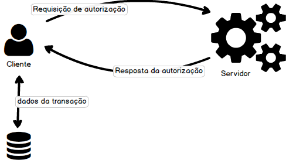
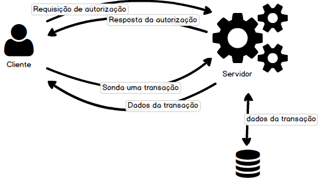

# Hire me

Desafio para avaliar as suas habilidades como desenvolvedor.

## Instruções

Você deve:

1. Clonar esse repositório
2. Em seu _fork_, atenda os requisitos descritos abaixo:
  * Para desenvolvedores juniores, não é necessário fazer nenhum bonus point
  * Para desenvolvedores plenos, fazer os bonus point -> tópicos que tiverem :trophy: ao lado
  * Para desenvolvedores seniores, fazer os bônus points + diamond points -> tópicos que tiverem :gem: ao lado
3. [Nos envie um e-mail](mailto:devmicrotef@stone.com.br) com seu nome e link do repositório

## O desafio

O projeto consiste na implementação de duas aplicações (cliente-servidor) que simulem o processo de uma transação financeira.

### O cliente (dê um nome legal pra ele)

Deve ser uma aplicação desktop **simples** utilizando WPF. O layout **não será avaliado**, mas a escolha de componentes e estrutura do XAML serão.

Deve haver duas telas principais:

* **Tela de transação**: input dos dados da transação e envio da transação para o servidor.
* **Tela de consulta das transações efetuadas**: lista das transações efetuadas.

#### :gem: Catálogo de cartões virtuais

Criar um catálogo de cartões virtuais (o número que você achar razoável para testar diferentes cenários), que estarão disponíveis quando o cliente for fazer uma compra. Esses cartões deverão ter propriedades a mais do que o cartão "básico" descrito abaixo.

* A senha de cada cartão do catálogo deve estar criptografada de algum jeito
* Com esse catálogo, a verificação da senha do cartão deve ser feita apenas pelo servidor

### O servidor (dê um nome legal pra ele)

O servidor irá simular justamente o que a Stone é, uma **adquirente**. No mundo real, uma adquirente se comunica com o banco (emissor do cartão de crédito/débito) e com a bandeira (Visa, MasterCard, American Express, etc). O servidor não precisará se preocupar com isso, apenas irá simular uma transação financeira de acordo com alguns parâmetros.

Sinta-se livre para utilizar a tecnologia que quiser, desde que cumpra os requisitos abaixo. õ/

O servidor deve esperar por uma transação. Assim que o cliente enviar uma requisição (como demonstrado no esquema a seguir), o servidor deve usar **parâmetros de validação dos dados a transação** e **parâmetros randômicos** _(você pode usar outro parâmetro, mas documente em algum canto!)_ para retornar sucesso ou erro na transação. 

**Códigos de retorno**

Código | Explicação
--- | ---
Aprovado | Transação aprovada
Transação negada | Transação negada
Saldo insuficiente | Portador do cartão não possui saldo
Valor inválido | Mínimo de 10 centavos
Cartão bloqueado | Quando o cartão está bloqueado (_dãa!_)
Erro no tamanho da senha | Senha deve ter entre 4 e 6 dítigos
:trophy: Senha inválida | A senha enviada é inválida

:trophy: Você pode (_e deve!_) adicionar novos códigos de retorno.

#### :trophy: Cadastro dos clientes

Deverá ser capaz de cadastrar clientes que possam passar transações no seu servidor. O limite de crédito de cada cliente deve ser considerado.

### Comunicação entre cliente e servidor

A comunicação pode acontecer em **JSON ou XML**.

#### Autorização

#### :trophy: Sondagem das transações

## O modelo de dados

:trophy: O modelo descrito aqui pode (_e deve!_) ser incrementado.

### Card

Propriedade | Descrição
--- | ---
CardholderName | Nome do portador do cartão
Number | Os números que são impressos no cartão, podendo variar entre 12 à 19 dígitos
ExpirationDate | Data de expiração do cartão
CardBrand | Bandeira do cartão
Password | Senha do cartão
Type | Chip ou tarja magnética 
HasPassword | Se o cartão possui senha. Apenas cartões de tarja magnética podem ter essa propriedade como `True`

### Transaction

Propriedade | Descrição
--- | ---
Amount | Valor da transação
Type | Tipo da transação
Card | Propriedades do cartão
Number | Número de parcelas, **se for uma transação de crédito parcelado**
 
### O que será avaliado?

1. Desenho e arquitetura da solução
2. Padrões do projeto utilizados
3. Organização, documentação e legibilidade do código
4. :trophy: Mapeamento ORM
5. Uso de biblioteca de terceiros
6. Criatividade
7. :trophy: :gem: Testes de unidade e _mocking_

### Inspiração

Esse desafio foi inspirado no layout maravilhoso do projeto [hire.me feito pela Bemobi](https://github.com/bemobi/hire.me).